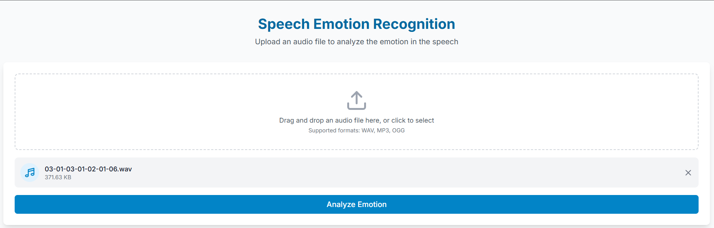
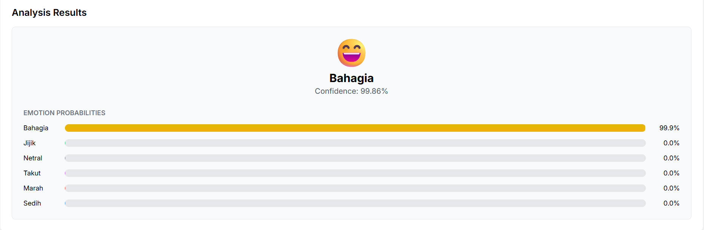

# Speech Emotion Recognition Frontend

This project implements a user-friendly frontend for a deep learning-based speech emotion recognition (SER) system. The application allows users to upload audio files and receive emotion predictions using a Wav2Vec2 model trained to classify emotions into six categories: anger, disgust, fear, happiness, neutral, and sadness.

## Project Overview

Speech Emotion Recognition (SER) is the task of recognizing human emotions from speech signals. This frontend application provides an intuitive interface to interact with a fine-tuned Wav2Vec2 model that classifies emotions in speech recordings. The model is trained on an Indonesian speech emotion dataset and can recognize emotions in both Indonesian and English speech.

## Features

- Simple and intuitive user interface
- Audio file upload functionality
- Real-time emotion prediction
- Visualization of prediction results with confidence scores
- Support for common audio formats (.wav, .mp3)

## Application Interface

### Initial View
The application presents a clean interface where users can upload their audio files for emotion analysis.

### File Input
Users can select an audio file from their device to upload for emotion prediction.

### Results Display
After processing, the application displays the predicted emotion along with confidence scores.

## Supported Emotions

The application can recognize the following emotions:
- Anger (marah)
- Disgust (jijik)
- Fear (takut)
- Happiness (bahagia)
- Neutral (netral)
- Sadness (sedih)

## Usage

To use the Speech Emotion Recognition application:

1. Open the application in your web browser
2. Click on the upload button to select an audio file
3. Wait for the model to process the audio
4. View the predicted emotion and confidence score

## Technologies Used

- React.js for the frontend interface
- Axios for API communication
- Chart.js for visualization of prediction results
- Material-UI for component styling

## Future Work

- Add real-time audio recording capability
- Implement batch processing for multiple files
- Add support for more languages
- Enhance visualization with emotion trends over time
- Develop mobile application version

## Related Projects

- [Backend model repository](https://github.com/KevinIW/Speech-Emotion-Recognition)
- [Trained model on HuggingFace](https://huggingface.co/Miracle12345/Speech-Emotion-Recognition)

## Credits

- The base pretrained model is made by [ehcalabres](https://huggingface.co/ehcalabres) in HuggingFace
- Project developed in collaboration with [iqzaardiansyah](https://github.com/iqzaardiansyah)
- Training dataset provided by [Kaggle competition](https://www.kaggle.com/competitions/speech-emotion-recognition-dl-genap-2024-2025)
- Our trained model is available on [HuggingFace](https://huggingface.co/Miracle12345/Speech-Emotion-Recognition)